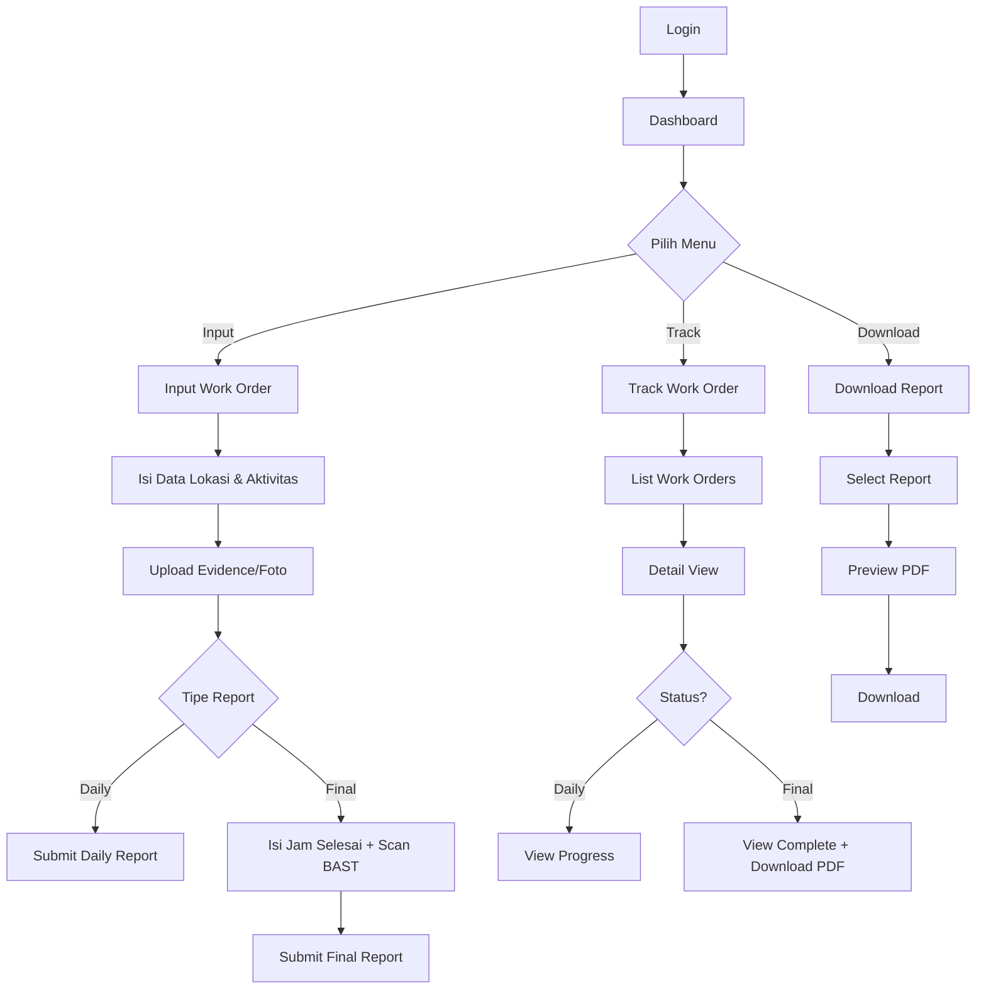
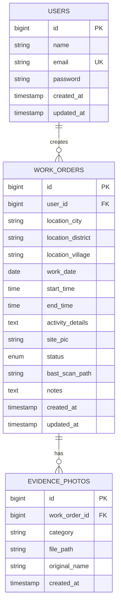

# Product Requirements Document (PRD)
# TPAS Work Form - Field Work Order Management System

---

## 📋 Ringkasan Eksekutif

| Aspek | Detail |
|-------|--------|
| **Nama Proyek** | TPAS Work Form |
| **Versi Dokumen** | 1.0 |
| **Tanggal** | 7 Januari 2026 |
| **Stakeholder** | Tiga Putra Andalan Sejati |
| **Target Rilis** | TBD |

---

## 1. Pendahuluan
    
### 1.1 Latar Belakang
Aplikasi **TPAS Work Form** adalah platform manajemen laporan lapangan (Work Order) yang dirancang untuk memantau aktivitas pekerjaan dari tahap input hingga penyelesaian laporan (Final Report). Aplikasi ini dikembangkan untuk mendukung digitalisasi pelaporan aktivitas lapangan tim Tiga Putra Andalan Sejati.

### 1.2 Tujuan Proyek
- ✅ Digitalisasi pelaporan aktivitas lapangan
- ✅ Pemantauan status pekerjaan secara real-time
- ✅ Otomatisasi pembuatan laporan PDF
- ✅ Penyederhanaan proses tracking work order

### 1.3 Target Pengguna

| Persona | Deskripsi | Kebutuhan Utama |
|---------|-----------|-----------------|
| **Teknisi/Petugas Lapangan** | Pengguna utama yang mengisi form di lokasi kerja | Input cepat, upload foto, akses mobile |
| **Admin Lapangan** | Pengawas yang memantau dan mengelola laporan | Tracking status, download report, overview |

---

## 2. Tech Stack & Arsitektur

### 2.1 Technology Stack

```
┌─────────────────────────────────────────────────────────────┐
│                      FRONTEND LAYER                          │
├─────────────────────────────────────────────────────────────┤
│  Tailwind CSS (Mobile-First)  │  Alpine.js (Interactivity)  │
└─────────────────────────────────────────────────────────────┘
                              │
                              ▼
┌─────────────────────────────────────────────────────────────┐
│                      BACKEND LAYER                           │
├─────────────────────────────────────────────────────────────┤
│              Laravel 10/11 (PHP Framework)                   │
│  ┌──────────────┐  ┌──────────────┐  ┌──────────────────┐   │
│  │ Auth System  │  │ API Routes   │  │ Blade Templates  │   │
│  └──────────────┘  └──────────────┘  └──────────────────┘   │
└─────────────────────────────────────────────────────────────┘
                              │
                              ▼
┌─────────────────────────────────────────────────────────────┐
│                      DATA LAYER                              │
├─────────────────────────────────────────────────────────────┤
│                         MySQL                                │
└─────────────────────────────────────────────────────────────┘
```

### 2.2 Packages & Dependencies

| Package | Fungsi | Prioritas |
|---------|--------|-----------|
| `laravel/framework` | Core framework | Wajib |
| `barryvdh/laravel-dompdf` | PDF Generator | Wajib |
| `intervention/image` | Kompresi & manipulasi foto | Wajib |
| `livewire/livewire` | Reactive components (optional) | Opsional |

### 2.3 Security Requirements
- Middleware Auth Laravel untuk proteksi route
- CSRF Protection pada semua form
- Validasi input server-side
- Sanitasi file upload (whitelist extension: jpg, jpeg, png, pdf)

---

## 3. User Flow & Arsitektur Alur Kerja



---

## 4. Spesifikasi Fungsional

### 4.1 Modul Authentication

| Fitur | Deskripsi | Prioritas |
|-------|-----------|-----------|
| Login | Form login dengan email/username & password | P0 |
| Logout | Tombol logout di sidebar/hamburger menu | P0 |
| Session Management | Auto-logout setelah periode inaktif | P1 |
| Remember Me | Opsi untuk menyimpan sesi login | P2 |

**UI Reference:** Template 2 - Hamburger/dot menu di pojok kiri atas

---

### 4.2 Modul Dashboard

| Fitur | Deskripsi | Prioritas |
|-------|-----------|-----------|
| Quick Access Cards | 3 kartu menu besar: Input, Track, Download | P0 |
| Status Summary | Ringkasan jumlah Work Order per status | P1 |
| Recent Activity | Daftar aktivitas terbaru | P2 |

**UI Reference:** Template 1 - 3 kartu menu besar

**Wireframe Layout:**
```
┌──────────────────────────────────────┐
│  ☰  TPAS Work Form           [User]  │
├──────────────────────────────────────┤
│                                      │
│  ┌────────────┐  ┌────────────┐     │
│  │   📝       │  │   📊       │     │
│  │   INPUT    │  │   TRACK    │     │
│  │ Work Order │  │ Work Order │     │
│  └────────────┘  └────────────┘     │
│                                      │
│  ┌────────────────────────────┐     │
│  │        📥 DOWNLOAD         │     │
│  │          Report            │     │
│  └────────────────────────────┘     │
│                                      │
└──────────────────────────────────────┘
```

---

### 4.3 Modul Input Work Order

| Field | Tipe | Validasi | Required |
|-------|------|----------|----------|
| Kota | Select/Text | - | ✅ |
| Kecamatan | Select/Text | - | ✅ |
| Desa/Kelurahan | Select/Text | - | ✅ |
| Tanggal Kerja | Date | Format: YYYY-MM-DD | ✅ |
| Jam Mulai | Time | Format: HH:mm | ✅ |
| Jam Selesai | Time | Format: HH:mm | ❌ (Daily) / ✅ (Final) |
| Jenis Aktivitas | Textarea | Min 10 karakter | ✅ |
| Site PIC | Text | - | ✅ |
| Catatan | Textarea | - | ❌ |

**UI Reference:** Template 4

---

### 4.4 Modul Evidence/Foto Upload

| Kategori Foto | Deskripsi | Required |
|---------------|-----------|----------|
| On Site | Foto lokasi/site | ✅ |
| Area Pekerjaan | Foto area kerja | ✅ |
| Bukti Pekerjaan | Foto hasil pekerjaan | ✅ |
| Dokumentasi Lain | Foto tambahan | ❌ |

**Technical Requirements:**
- Akses langsung ke kamera HP
- Kompresi otomatis (max 1MB per foto)
- Format: JPG, JPEG, PNG
- Grid layout untuk preview

**UI Reference:** Template 5

---

### 4.5 Modul Daily Report

| Fitur | Deskripsi |
|-------|-----------|
| Status | Otomatis set ke "Daily" |
| Jam Selesai | **TIDAK WAJIB** diisi |
| Evidence | Minimal 1 foto per kategori wajib |
| Submit | Tombol submit dengan konfirmasi |

**UI Reference:** Template 1.3

---

### 4.6 Modul Final Report

| Fitur | Deskripsi |
|-------|-----------|
| Status | Otomatis set ke "Final" |
| Jam Selesai | **WAJIB** diisi |
| Scan BAST | **WAJIB** upload dokumen BAST |
| Catatan Final | Field catatan tambahan |
| Submit | Tombol submit dengan konfirmasi |

> [!IMPORTANT]
> Final Report tidak dapat disubmit tanpa mengisi Jam Selesai dan melampirkan Scan BAST (Berita Acara Serah Terima).

**UI Reference:** Template 6 & 1.4

---

### 4.7 Modul Track Work Order

| Fitur | Deskripsi |
|-------|-----------|
| List View | Kartu daftar work order dengan filter |
| Status Badge | Label "Daily" (kuning) / "Final" (hijau) |
| Search | Pencarian berdasarkan lokasi |
| Filter | Filter berdasarkan status, tanggal |
| Detail View | Klik kartu untuk melihat detail |

**UI Reference:** Template 1.2

**Card Layout:**
```
┌─────────────────────────────────────┐
│ 📍 Kota, Kecamatan, Desa            │
│ 📅 12 Jan 2026    ⏰ 08:00 - --:--  │
│ ┌──────────┐                        │
│ │  DAILY   │                        │
│ └──────────┘                        │
└─────────────────────────────────────┘
```

---

### 4.8 Modul PDF Engine & Download

| Fitur | Deskripsi |
|-------|-----------|
| Preview BAST | Pratinjau dokumen BAST yang diupload |
| Generate PDF | Compile semua data menjadi PDF report |
| Download | Tombol unduh file PDF |

**PDF Content Structure:**
1. Header (Logo, Judul, Tanggal)
2. Informasi Lokasi
3. Detail Aktivitas
4. Timeline (Jam Mulai - Selesai)
5. Evidence Photos (Grid)
6. Scan BAST (jika Final)
7. Tanda Tangan Digital / QR Code

**UI Reference:** Template 1.5

---

## 5. Database Schema

### 5.1 Entity Relationship Diagram



### 5.2 Tabel: `work_orders`

| Column | Type | Constraints | Description |
|--------|------|-------------|-------------|
| `id` | BIGINT | PRIMARY KEY, AUTO_INCREMENT | ID unik |
| `user_id` | BIGINT | FOREIGN KEY | Relasi ke users |
| `location_city` | VARCHAR(100) | NOT NULL | Nama kota |
| `location_district` | VARCHAR(100) | NOT NULL | Nama kecamatan |
| `location_village` | VARCHAR(100) | NOT NULL | Nama desa/kelurahan |
| `work_date` | DATE | NOT NULL | Tanggal pekerjaan |
| `start_time` | TIME | NOT NULL | Jam mulai |
| `end_time` | TIME | NULLABLE | Jam selesai |
| `activity_details` | TEXT | NOT NULL | Detail aktivitas |
| `site_pic` | VARCHAR(100) | NOT NULL | Nama Site PIC |
| `status` | ENUM('Daily','Final') | DEFAULT 'Daily' | Status laporan |
| `bast_scan_path` | VARCHAR(255) | NULLABLE | Path file BAST |
| `notes` | TEXT | NULLABLE | Catatan tambahan |
| `created_at` | TIMESTAMP | - | Waktu dibuat |
| `updated_at` | TIMESTAMP | - | Waktu diupdate |

### 5.3 Tabel: `evidence_photos`

| Column | Type | Constraints | Description |
|--------|------|-------------|-------------|
| `id` | BIGINT | PRIMARY KEY, AUTO_INCREMENT | ID unik |
| `work_order_id` | BIGINT | FOREIGN KEY | Relasi ke work_orders |
| `category` | VARCHAR(50) | NOT NULL | Kategori foto |
| `file_path` | VARCHAR(255) | NOT NULL | Path file |
| `original_name` | VARCHAR(255) | NOT NULL | Nama file asli |
| `created_at` | TIMESTAMP | - | Waktu dibuat |

---

## 6. Navigasi & UI/UX

### 6.1 Sitemap

```
├── /login
├── /dashboard (Home)
│   ├── /work-orders
│   │   ├── /create (Input Work Order)
│   │   ├── /{id} (Detail)
│   │   ├── /{id}/daily-report
│   │   └── /{id}/final-report
│   ├── /track
│   │   ├── / (List View)
│   │   └── /{id} (Detail View)
│   └── /reports
│       ├── / (List)
│       ├── /{id}/preview
│       └── /{id}/download
└── /logout
```

### 6.2 Mobile-First Design Principles

> [!TIP]
> Aplikasi dioptimalkan untuk penggunaan lapangan dengan perangkat mobile.

| Prinsip | Implementasi |
|---------|--------------|
| Touch-Friendly | Minimum touch target 44x44px |
| Fast Loading | Lazy load images, minimal JS |
| Offline Consideration | Form data tersimpan di localStorage |
| Camera Access | Direct camera capture untuk upload foto |
| Large Typography | Minimum 16px untuk body text |

### 6.3 Component Library

| Component | Penggunaan |
|-----------|------------|
| Card | Dashboard menu, Work Order list item |
| Form Input | Text, Select, Date, Time, Textarea |
| Button | Primary (Blue), Secondary (Gray), Danger (Red) |
| Badge | Status indicator (Daily/Final) |
| Modal | Konfirmasi, Preview foto |
| Toast | Notifikasi sukses/error |

---

## 7. API Endpoints (Optional REST API)

| Method | Endpoint | Description |
|--------|----------|-------------|
| POST | `/api/login` | Authentication |
| GET | `/api/work-orders` | List all work orders |
| POST | `/api/work-orders` | Create new work order |
| GET | `/api/work-orders/{id}` | Get work order detail |
| PUT | `/api/work-orders/{id}` | Update work order |
| POST | `/api/work-orders/{id}/evidence` | Upload evidence photo |
| POST | `/api/work-orders/{id}/submit-daily` | Submit as daily report |
| POST | `/api/work-orders/{id}/submit-final` | Submit as final report |
| GET | `/api/work-orders/{id}/pdf` | Download PDF report |

---

## 8. Non-Functional Requirements

### 8.1 Performance
- Page load time: < 3 detik (3G connection)
- Image compression: Max 1MB per foto
- API response time: < 500ms

### 8.2 Scalability
- Support hingga 1000 work orders per bulan
- Concurrent users: 50

### 8.3 Availability
- Uptime target: 99%
- Backup database: Daily

### 8.4 Browser Support
- Chrome Mobile (Prioritas 1)
- Safari iOS (Prioritas 1)
- Firefox Mobile (Prioritas 2)
- Chrome Desktop (Prioritas 2)

---

## 9. Milestones & Timeline

| Phase | Deliverables | Durasi |
|-------|--------------|--------|
| **Phase 1: Setup** | Project setup, Auth, Database | 1 minggu |
| **Phase 2: Core Features** | Input, Daily Report, Final Report | 2 minggu |
| **Phase 3: Tracking & PDF** | Track module, PDF generator | 1 minggu |
| **Phase 4: Polish** | Testing, bug fixes, optimization | 1 minggu |

**Total Estimasi: 5 Minggu**

---

## 10. Appendix

### 10.1 Glossary

| Term | Definition |
|------|------------|
| **Work Order** | Dokumen perintah kerja lapangan |
| **BAST** | Berita Acara Serah Terima |
| **Site PIC** | Person In Charge di lokasi kerja |
| **Daily Report** | Laporan kemajuan harian (belum selesai) |
| **Final Report** | Laporan penutupan (pekerjaan selesai) |

### 10.2 Revision History

| Versi | Tanggal | Penulis | Deskripsi |
|-------|---------|---------|-----------|
| 1.0 | 7 Jan 2026 | - | Initial document |

---

> [!NOTE]
> Dokumen ini bersifat living document dan akan diperbarui sesuai dengan perkembangan proyek.
